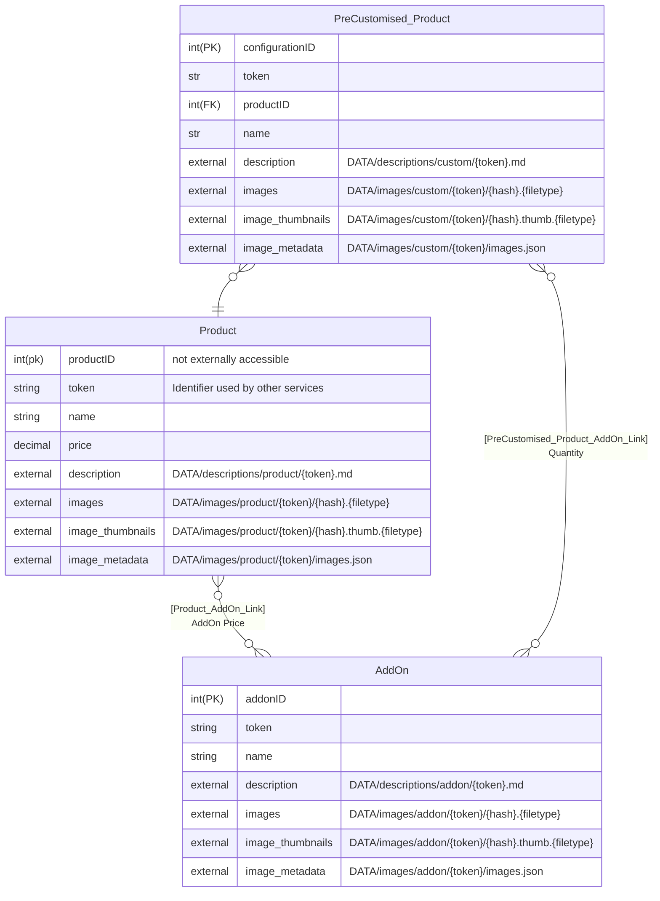
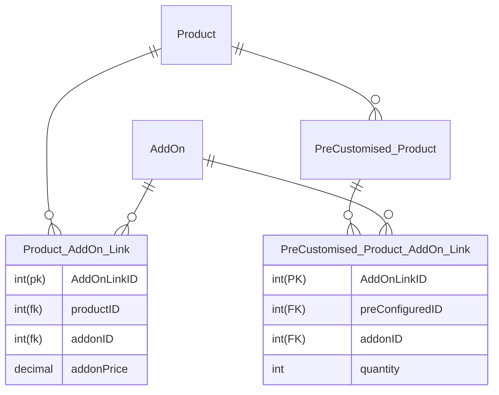
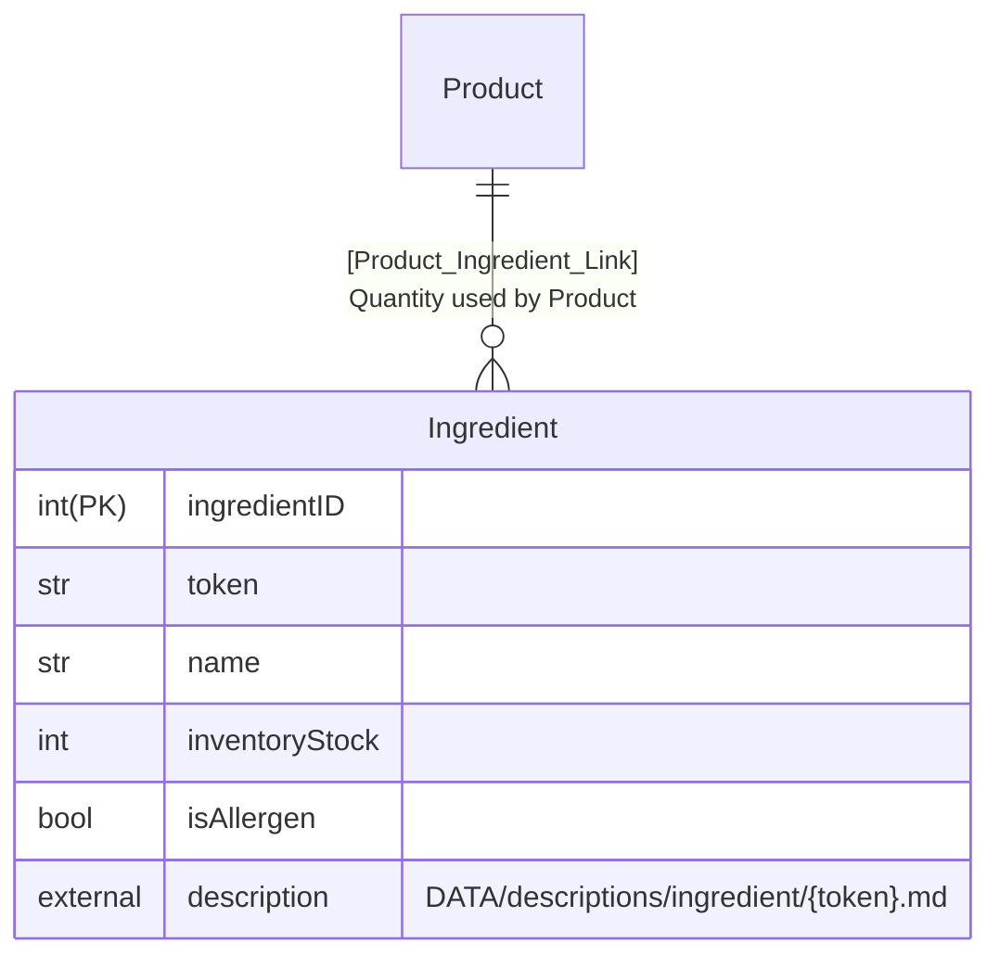

# Menu Manager Database Entity Relationship Diagram

## Main Table Diagram

These tables are the main functionality of the system, and will be implemented first.

## Link Table Diagram

These tables, only mentioned in the above section, are essential for a fully working relational database, and also store additional data about items that differ between links.

## Future Planned Tables

These are the tables that *should* be implemented by this system, but are a lower priority, so will be added later on.

This system is also needed to store the information about what is available at different franchise locations, prices if they differ from the default, and per-restaurants stock for the above table. The method for this is currently not determined, but may be done with a new table for storing information that differs on each item where it differs.
